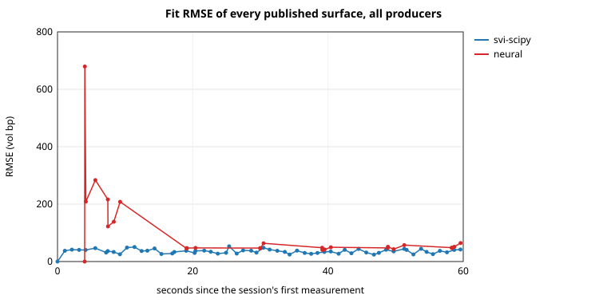
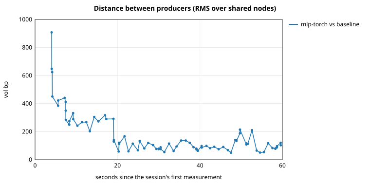
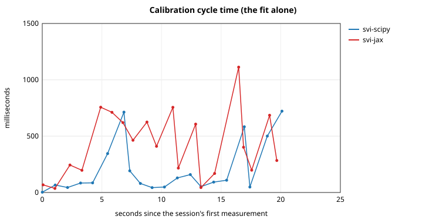

# volengine -- [documentation](https://gabriel31921.github.io/Volengine/)

A real-time, multi-market implied volatility surface calibration engine, built with Hexagonal
Architecture and Domain-Driven Design (DDD).

It ingests option chains -- the live Deribit BTC book, a synthetic market with a known answer, or a
recording of either -- calibrates a volatility surface with **two competing engines**, a parametric
one (SVI, in SciPy or JAX) and a neural one (an MLP, in PyTorch), and values a portfolio off each
surface with explicit guarantees about freshness and arbitrage.

> **Status: Phases 1, 2 and 3 delivered.** Every engine is reachable from a configuration file, the
> pipeline runs end to end on synthetic and live data, every test run replays thirty seconds of
> the real Deribit chain through the whole engine, and the benchmarks below were generated by
> code in `benchmarks/` from the engine's own metrics. What was left open on purpose is in
> `docs/SEAMS.md`.

## The context map

Four bounded contexts, and one rule that everything else protects: **they talk only through the
immutable data transfer objects in `contracts/`**. No tensor, no exchange type and no domain object
crosses a boundary.

```text
                       ┌──────────────────────────────┐
                       │         Market Data           │  upstream
                       │  QuoteChain · OptionQuote     │
                       │  MarketConventions            │
                       │  feeds: deribit · synthetic · │
                       │  recorded (replay) · constant │
                       └──────────────┬───────────────┘
                                      │  MarketSnapshot
                    ┌─────────────────┴──────────────────┐
                    ▼ ACL                                 ▼ ACL
       ┌─────────────────────────┐          ┌─────────────────────────┐
       │   Parametric Pricing     │          │     Neural Surface       │
       │  SVISlice · SVIParams    │ competing│  LearnedSurface          │
       │  CalibrationState        │◄────────►│  ReplayBuffer · gate     │
       │  svi-scipy · svi-jax     │ contexts │  mlp-torch               │
       └────────────┬────────────┘          └────────────┬────────────┘
                    │        CalibratedSurface (one contract)      │
                    └─────────────────┬──────────────────┘
                                      ▼ ACL
                       ┌──────────────────────────────┐
                       │             Risk              │  downstream
                       │  Portfolio · RiskReport       │
                       │  FreshnessPolicy · comparison │
                       └──────────────────────────────┘
```

An *ACL* (anti-corruption layer) is the one module per context that translates the published
contract into the context's own model and back. It is why Market Data's `OptionQuote` (an
*observation*, with bid, ask, size and age) and Risk's `Position` (a *contract* someone holds) are
different types on purpose: a shared canonical "option" is the anti-pattern DDD exists to prevent.
The domain layers do not even know the contracts exist -- `QuoteChain.snapshot()` returns an
internal `ChainSnapshot`, and only the ACL turns it into a `MarketSnapshot` -- which is what makes
the published language replaceable without touching business logic, and what lets the import
rules be checked by a tool (`uv run lint-imports`) rather than by review.

The **shared kernel** is the one sanctioned exception to "no context imports another", and it stays
small: value objects, aware-timestamp validation, and the two closed forms that every context would
want changed if they were wrong -- Black-76 (ADR-014) and the raw SVI curve (ADR-026). Mathematics
lives once; models are duplicated deliberately.

| Context              | Role                                                    | Publishes           |
| -------------------- | ------------------------------------------------------- | ------------------- |
| `market_data`        | Ingests, flags and snapshots option chains              | `MarketSnapshot`    |
| `parametric_pricing` | Fits raw SVI per expiry (SciPy or JAX)                  | `CalibratedSurface` |
| `neural_surface`     | Learns the whole surface with a small network (PyTorch) | `CalibratedSurface` |
| `risk`               | Values the book, enforces freshness, compares producers | `RiskReport`        |

## Two competing engines behind one contract

The central demonstration of the project is that two radically different models of the same
object can be swapped without anything downstream noticing.

**The parametric engine** fits raw SVI -- five numbers per expiry, `w(k) = a + b(ρ(k − m) +
√((k − m)² + σ²))`, where `w` is total implied variance and `k` log-forward-moneyness. Each expiry
is a small least-squares problem over vega-weighted volatility residuals with a soft penalty on
Durrleman's no-butterfly condition. It exists twice: `svi-scipy`, a trust-region search with
`scipy.optimize.least_squares`, and `svi-jax`, the same objective residual for residual, compiled
once over a fixed padded shape (ADR-009) and searched by Adam when warm and multi-start L-BFGS when
cold (ADR-029). Same loss, two optimisers -- which is what makes them benchmarkable against each
other.

**The neural engine** fits one small MLP over the whole `(k, T)` plane. It fine-tunes a few steps
per snapshot from a replay buffer stratified by moneyness and tenor, carries its optimiser state
across snapshots, retrains from scratch on a schedule, and is published only through a hard
no-arbitrage gate on a dense mesh: *soft constraints train, hard constraints govern* (ADR-010).

**What they share is exactly the contract and nothing else.** Both receive the same
`MarketSnapshot`, in which every convention-dependent number -- tenor in years, forward, exact
expiry instant -- has already been computed, so neither learns which venue it is fitting. Both
publish a `CalibratedSurface`: a grid of implied volatilities on the same nodes, plus fit metrics
and a status. The contract is *data*, not an evaluable object (ADR-001): no `implied_vol(K, T)`
method, no greeks. A consumer interpolates with its own method, which is why Risk can value a book
off either surface -- and compare the two -- without importing anything from either producer.

Two tests keep that standing: the contract harness (`tests/parametric_pricing/test_calibrator_contract.py`,
`pytest -m contract`) runs every producer through the same assertions, and the import-linter
contracts in `pyproject.toml` fail the build if a context reaches into another.

## The benchmarks

Generated by `benchmarks/`, which runs the shipped example configurations through the real
composition root with the metrics sink pointed at a file, then reads that file back. **Every
number is the engine's own measurement**; the full reports, the raw metrics files and the charts
are in [`benchmarks/results/`](benchmarks/results/). They were taken on one CPU machine on
2026-10-04 and say so in their headers; the shape of the comparison is the result, not the
milliseconds.

The market is synthetic on purpose: a known SVI surface priced through Black-76 and spoiled with
**50 bp of volatility noise**, wide spreads and junk quotes. A fit that has recovered the surface
therefore shows an RMSE of about the noise, and no lower.

### scipy vs. JAX — time, convergence, lines of code

[Full report](benchmarks/results/scipy-vs-jax.md). Each engine runs alone (so neither is timed
while the other holds Python's interpreter lock), then both side by side.

| | `svi-scipy` | `svi-jax` |
|---|---:|---:|
| Fit RMSE, vol bp, p50 | 37.1 | 38.2 |
| Slices accepted / attempted | 55 / 58 | 58 / 58 |
| Warm cycle, ms, p50 (alone · side by side) | 83 · 92 | 204 · 410 |
| Objective evaluations per warm fit, p50 | 229 | 2,864 |
| Construction (JAX: compilation), s | 0.00 | 2.8 |
| Lines of code (code · physical) | 262 · 841 | 664 · 1,698 |

The reading: **the same answer, at very different costs.** Both reach the noise floor. On a CPU and
a chain this size the trust-region baseline does in a few hundred objective evaluations what Adam
does in a few thousand, so SciPy is about 2.5 times cheaper per warm fit, needs no compilation and
is less than half the code. JAX's edge is elsewhere: it accepted every slice, where SciPy left three unconverged -- the
last snapshot's one-year slice among them, which matters below; and F3-A's controlled measurement found its cost flat in the
number of expiries (12 expiries × 25 strikes: 821 ms cold, 18.8 ms warm, against SciPy's 71 ms and
18.4 ms) where SciPy's grows with it. JAX would also differentiate the whole pipeline for greeks
(`parametric_pricing/adapters/jax_greeks.py`), which sits outside the contract.

### Parametric vs. neural — RMSE, violations, drift

[Full report](benchmarks/results/parametric-vs-neural.md), from a 60-cycle session (the example's
feed lengthened from 20, so the network's post-restart regime has more than a couple of points).

| | `svi-scipy` | `mlp-torch` |
|---|---:|---:|
| Fit RMSE, vol bp, p50 — whole session | 35.7 | 49.0 |
| — before the network's first restart | | 208.6 (max 679) |
| — from the first restart on | | 47.5 (max 64.5) |
| Published grids with an arbitrage breach | 0 of 60 | 0 of 26 |
| Restart jump (before vs. after a retrain), vol bp, p50 · max | no restart | 21.3 · 306 |
| Step between consecutive fits, vol bp, p50 | 129.7 | 17.9 |
| Fit time, ms, p50 · p95 | 162 · 807 | 187 · 8,626 |

**Which regime is measured matters more than any single number.** The network's first snapshot
rests on a handful of quotes; its cold start fits those, and ten warm steps per snapshot move it only
slowly towards the full chain -- up to 679 bp -- until the first scheduled restart retrains over the
whole buffer and it lands at the noise floor, beside SVI. It has no RMSE acceptance (the open
question in `docs/SEAMS.md`, Neural Surface), so those early fits are published. The p95 fit time is
the scheduled restart: about nine seconds of cold training on the learner's own thread, during which
the snapshots it misses are conflated away (34 in this session, every one of them on the
network's subscription).

**Violations**: none, for either engine, measured with one ruler -- Durrleman's condition and the
calendar condition on the published nodes every consumer receives (`benchmarks/surface_checks.py`) --
and none on the network's own, denser gate mesh either. The synthetic surface is benign: on the
golden fixture a gate set at exactly zero refused a 64 bp fit, which is why the shipped tolerance
is `1e-4` (`docs/SEAMS.md`).

**Drift** is where the two update regimes part ways. SVI runs a full search on every snapshot
(warm-started, but free to move) and its published grid moves by about 130 bp RMS from one snapshot to
the next, measured over a grid that reaches past the quoted strikes. The network fine-tunes, so it
barely moves between snapshots (18 bp) and moves in jumps at its restarts: 21 bp at a typical one,
306 bp at the first, which replaces the thin cold start. Full recalibration against incremental
adaptation, in two numbers.

### Risk's comparative report

The same book valued off two surfaces, position by position (Design §7.3). At the end of the
parametric-vs-neural session:

| Position | Vol `svi-scipy` | Vol `mlp-torch` | Vol diff (bp) | Value diff | Delta diff | Vega diff |
|---|---:|---:|---:|---:|---:|---:|
| 1 × BTC call 60000, 2027-06-25 | 0.5082 | 0.5087 | +4.8 | +9.54 | −0.0094 | −0.87 |

Where the book sits, the two models agree to five basis points; the surfaces themselves are still
103 bp apart RMS over the 51 grid points compared. The distance lives where this book does not.

The scipy-vs-JAX session ends with the more instructive one: a **515 bp** difference at the same
position. It is not a disagreement between optimisers. SciPy's last surface was `DEGRADED` -- its
one-year slice did not converge and was dropped -- so the position, about nine months out, was valued
past the last tenor of a two-expiry grid, where total variance is held flat. Risk's report still
said `NORMAL`, because the status does not travel past Risk's cache: a gap `docs/SEAMS.md` already
recorded, made visible by the comparison it was designed for. The benchmark reports print which
surface each side was valued off for exactly this reason.

### Charts

Every chart is drawn from a metrics file and nothing else, by `benchmarks/charts.py`, which works on
any session recorded with `[metrics] sink = "csv"`:





## Running it

```bash
uv sync --group dev
uv run volengine report --config examples/walking-skeleton.toml --count 2   # trivial adapters
uv run volengine report --config examples/synthetic-svi.toml --count 2      # SVI on a known market
```

The shipped configurations, each commented line by line with the measurement behind every
threshold:

| File | What it runs | Needs |
|---|---|---|
| `examples/walking-skeleton.toml` | constant chain → flat-vol calibrator → console | — |
| `examples/synthetic-svi.toml` | synthetic market → `svi-scipy` | — |
| `examples/svi-scipy-vs-jax.toml` | both SVI engines on one market, compared | `--extra jax` |
| `examples/svi-scipy-vs-mlp-torch.toml` | SVI and the network on one market, compared | `--extra neural` |
| `examples/deribit-live.toml` | the live Deribit BTC chain → `svi-scipy` | `--extra deribit` |
| `examples/multi-market.toml` | Deribit and a synthetic market on one bus | `--extra deribit` |

`volengine run` drives a configuration until its feed ends or `--duration` elapses; `record` taps a
session into JSON Lines, and `replay` runs the whole engine off that file alone, on a clock the
recording moves, so two replays write the same report byte for byte (ADR-004, with the caveat about
conflation on long sessions that `docs/SEAMS.md` records). `[metrics] sink = "csv"` persists every
measurement the contexts emit; `--metrics` / `--no-metrics` override the table.

The benchmarks and the charts:

```bash
uv run --extra jax    python -m benchmarks.scipy_vs_jax
uv run --extra neural python -m benchmarks.parametric_vs_neural --cycles 60
uv run python -m benchmarks.charts metrics.csv --out-dir charts/
```

## Project structure

```text
src/volengine/
├── shared_kernel/domain/   value objects, and the mathematics every context shares
├── contracts/              published language: the DTOs that cross boundaries
├── platform/               in-process conflating bus, clocks, metrics sinks, executors
├── market_data/            domain · application · adapters
├── parametric_pricing/     domain · application · adapters
├── neural_surface/         domain · application · adapters
├── risk/                   domain · application · adapters
└── entrypoints/            cli.py, pipeline.py (the composition root), config.py
benchmarks/                 the narrative deliverables, regenerable; results/ holds the output
examples/                   shipped configurations
tests/                      one package per context, plus architecture and end-to-end tests
```

Each context follows the same hexagonal shape: `domain/` (pure business logic on the standard
library and numpy), `application/` (use cases and the ACL), and `adapters/` (port implementations:
SciPy, JAX, PyTorch, websockets). Use cases are synchronous handlers that return events; only the
composition root touches the bus (ADR-016).

## Development

```bash
uv sync --group dev          # development environment (without JAX or PyTorch)
uv sync --extra jax          # adds the JAX calibrator
uv sync --extra neural       # adds the PyTorch learner, CPU build
uv sync --extra deribit      # adds the live Deribit feed

uv run pytest                # tests
uv run ruff check .          # lint
uv run lint-imports          # import rules between layers
uv run mypy                  # type checking

bash scripts/verify.sh       # all of the above, in the order CI runs them
```

`scripts/verify.sh` is the single definition of "healthy": the developer, the review agents and
`.github/workflows/ci.yml` all run that one script (ADR-024). CI runs it three times: once bare,
once with `--extra jax` and once with `--extra neural`. The Deribit tests need no extra, because
the adapter imports its network libraries lazily.

## Documentation

**`docs/adr/`** holds the architectural decision records -- 29 of them, one decision per file,
immutable. They are the answer to *why* the system is the way it is, and they are authoritative:
where a record and a planning document disagree, the record wins. `docs/adr/README.md` is the
index.

**`docs/SEAMS.md`** holds the gaps left open on purpose. Every item there was seen, weighed and
left, and several of them are visible in the benchmarks above -- read it before "fixing" one.

**`instructions/` is kept outside Git**, and holds the planning documents: `Design.md` (contexts
and contracts), `Plan.md` (phases), `Implementation.md` (signatures) and `STATE.md` (current build
state). Docstrings throughout the code cite them -- `Design §7.2`, `Implementation.md`'s sketch of
a type -- so a citation that cannot be followed from a clone is pointing at one of those four. The
ADRs are written so that the reasoning survives without them: where the code departs from a
planning document, the departure is argued in the docstring that owns it *and* collected in an
ADR (020, 021, 022, 023, 025, 027, 028, 029). `CLAUDE.md`, the standing rules this repository is
written to, is outside Git for the same reason; its import rules are executable and live in
`pyproject.toml`'s `[tool.importlinter]` contracts, which `tests/architecture/` runs.
