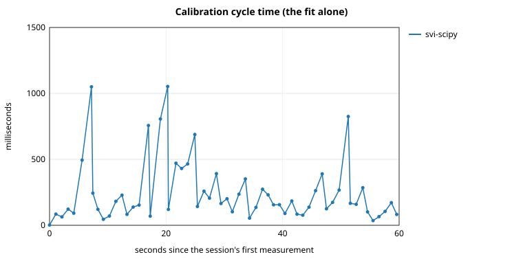
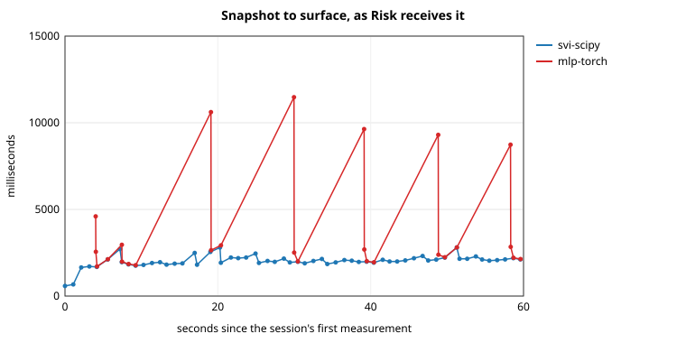
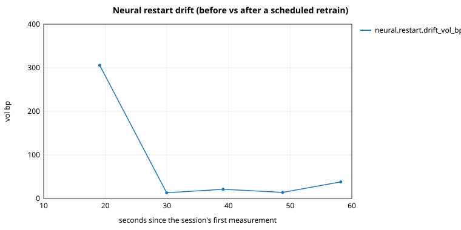
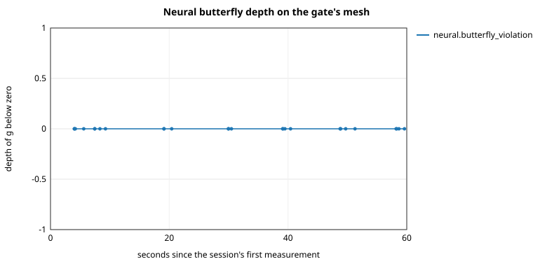

# Parametric vs. neural — RMSE, violations, drift

Measured 2026-10-04 20:02 UTC on Linux x86_64 (x86_64), Python 3.13.11; numpy 2.5.1, scipy 1.18.0, torch 2.14.0+cpu. Configuration `examples/svi-scipy-vs-mlp-torch.toml` with the feed's `cycles` overridden to 60, session wall time 60.2 s.

Generated by `benchmarks/parametric_vs_neural.py`. Every number below is read back from the session's metrics file, `parametric-vs-neural.metrics.csv`, or computed on the surfaces the session published (violations on the published nodes, consecutive steps, fit time).

The network first restarted 19.1 s into the session; restarts in all: 5.

## RMSE

| RMSE, vol bp (p50 / p95 / max) | `svi-scipy` | `mlp-torch` |
|---|---:|---:|
| Whole session | 35.7 / 48.0 / 53.2 (n=60) | 49.0 / 266.8 / 679.4 (n=26) |
| Before the network's first restart |  | 208.6 / 540.8 / 679.4 (n=8) |
| From the first restart on |  | 47.5 / 63.8 / 64.5 (n=18) |

## Violations

| Violations | `svi-scipy` | `mlp-torch` |
|---|---:|---:|
| Published fits | 60 | 26 |
| Snapshots lost to a handler failure | 0 | 0 |
| Grids with any breach on the published nodes | 0 | 0 |
| Butterfly depth on the published nodes | 0.0e+00 / 0.0e+00 / 0.0e+00 (n=60) | 0.0e+00 / 0.0e+00 / 0.0e+00 (n=26) |
| Calendar crossing on the published nodes | 0.0e+00 / 0.0e+00 / 0.0e+00 (n=60) | 0.0e+00 / 0.0e+00 / 0.0e+00 (n=26) |
| Butterfly depth, network's own gate mesh |  | 0.0e+00 / 0.0e+00 / 0.0e+00 (n=26) |
| Calendar crossing, network's own gate mesh |  | 0.0e+00 / 0.0e+00 / 0.0e+00 (n=26) |
| Refused (parametric: calibration · neural: gate / diverged) | 0 | 0 / 0 |

## Drift

| Drift, vol bp (p50 / p95 / max) | `svi-scipy` | `mlp-torch` |
|---|---:|---:|
| Restart jump (before vs after a retrain) | no restart | 21.3 / 252.2 / 305.7 (n=5) |
| Step between consecutive published fits | 129.7 / 237.2 / 1318.1 (n=59) | 17.9 / 598.5 / 915.2 (n=25) |

## Time (side by side, one process)

| Time, ms (p50 / p95 / max) | `svi-scipy` | `mlp-torch` |
|---|---:|---:|
| Fit (FitMetrics.duration_ms) | 162.0 / 806.9 / 1052.6 (n=60) | 186.7 / 8626.4 / 9541.8 (n=26) |
| Snapshot to surface, as Risk receives it | 2033.0 / 2554.3 / 2801.0 (n=60) | 2535.9 / 10369.4 / 11473.6 (n=26) |

## Between the two

Distance between the two surfaces, RMS vol bp (p50 / p95 / max): 115.5 / 440.1 / 908.1 (n=82). Events discarded by conflation on the engine's subscriptions: 34 -- a snapshot that arrived while a producer was still busy replaced the one waiting for it (ADR-003).

### Risk's comparative report, at the end of the session

- `svi-scipy` valued off a `OK` surface, snapshot `BTC-SYNTH:00000059`, tenors (years) 0.081, 0.245, 0.999, fit RMSE 42.0 bp.
- `mlp-torch` valued off a `OK` surface, snapshot `BTC-SYNTH:00000059`, tenors (years) 0.081, 0.245, 0.999, fit RMSE 64.5 bp.

Market `BTC-SYNTH` · baseline `svi-scipy` (NORMAL) · challenger `mlp-torch` (NORMAL)

| Position | Vol baseline | Vol challenger | Vol diff (bp) | Value diff | Delta diff | Gamma diff | Vega diff |
|---|---:|---:|---:|---:|---:|---:|---:|
| 1 x BTC CALL 60000 2027-06-25 | 0.5082 | 0.5087 | +4.8 | +9.5385 | -0.009353 | -5.305e-06 | -0.8710 |

Total value difference over paired lines: +9.5385.
Surface distance over 51 nodes: RMS 102.8 bp, max 364.4 bp.

### Charts

