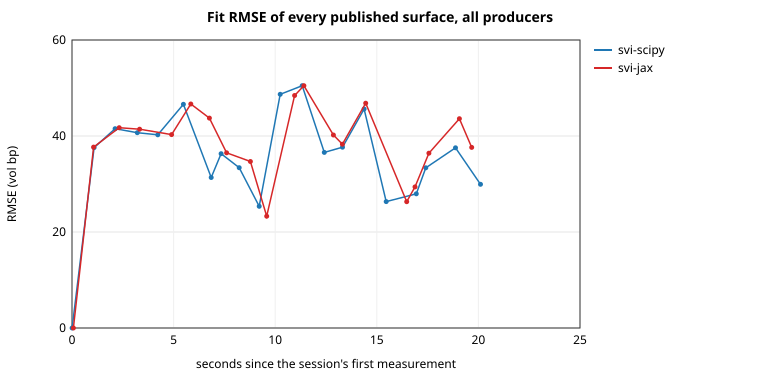
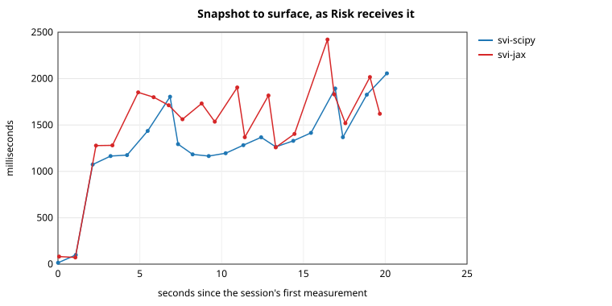
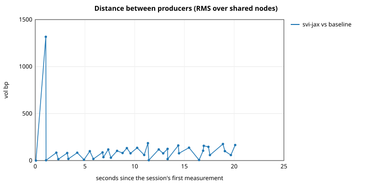

# scipy vs. JAX — the same SVI objective, two optimisers

Measured 2026-10-04 20:01 UTC on Linux x86_64 (x86_64), Python 3.13.11; numpy 2.5.1, scipy 1.18.0, jax 0.11.0, optax 0.2.8. Configuration `examples/svi-scipy-vs-jax.toml`, session wall time 60.1 s.

Generated by `benchmarks/scipy_vs_jax.py`. Every number below except construction time and lines of code is read back from a session's metrics file: `scipy-vs-jax.svi-scipy.metrics.csv`, `scipy-vs-jax.svi-jax.metrics.csv` for the solo sessions and `scipy-vs-jax.metrics.csv` for the side-by-side one.

## Time, convergence, lines of code

| Criterion | `svi-scipy` | `svi-jax` |
|---|---:|---:|
| Construction, s (includes jit) | 0.00 | 2.81 |
| Surfaces received by Risk (OK / DEGRADED / STALE) | 16 / 4 / 0 | 19 / 1 / 0 |
| Snapshots lost to a handler failure | 0 | 0 |
| Calibrations refused | 0 | 0 |
| Slices accepted / attempted | 55 / 58 | 58 / 58 |
| Slices not converged / at bound / over RMSE | 3 / 0 / 0 | 0 / 0 / 0 |
| Fit RMSE, vol bp (p50 / p95 / max) | 37.1 / 48.8 / 50.5 (n=20) | 38.2 / 48.6 / 50.5 (n=20) |
| First cycle (cold start, thin first snapshot), ms | 2.2 | 145.0 |
| Later cycles (warm start), ms (p50 / p95 / max) | 82.7 / 588.8 / 643.4 (n=19) | 203.7 / 840.7 / 1133.3 (n=19) |
| Later cycles **side by side**, ms (p50 / p95 / max) | 92.0 / 714.0 / 721.7 (n=19) | 409.7 / 792.2 / 1112.4 (n=19) |
| Snapshot to surface, ms (p50 / p95 / max) | 1384.4 / 1860.8 / 1982.1 (n=20) | 1483.8 / 2150.8 / 2623.8 (n=20) |
| Objective evaluations, first / warm p50 | 2 / 229 | 291 / 2864 |
| Lines: code / physical | 262 / 841 | 664 / 1698 |

## Side by side

Distance between the two surfaces, RMS vol bp (p50 / p95 / max): 83.1 / 176.8 / 1316.9 (n=39). Events discarded by conflation on the engine's subscriptions: 0.

### Risk's comparative report, at the end of the session

- `svi-scipy` valued off a `DEGRADED` surface, snapshot `BTC-SYNTH:00000019`, tenors (years) 0.081, 0.245, fit RMSE 29.9 bp.
- `svi-jax` valued off a `OK` surface, snapshot `BTC-SYNTH:00000019`, tenors (years) 0.081, 0.245, 0.999, fit RMSE 37.6 bp.

Market `BTC-SYNTH` · baseline `svi-scipy` (NORMAL) · challenger `svi-jax` (NORMAL)

| Position | Vol baseline | Vol challenger | Vol diff (bp) | Value diff | Delta diff | Gamma diff | Vega diff |
|---|---:|---:|---:|---:|---:|---:|---:|
| 1 x BTC CALL 60000 2027-06-25 | 0.5642 | 0.5127 | -514.9 | +3662.0494 | +0.024937 | -9.504e-06 | +8089.0533 |

Total value difference over paired lines: +3662.0494.
Surface distance over 34 nodes: RMS 165.2 bp, max 606.7 bp.

### Charts

